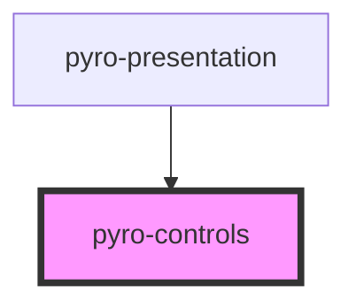

# pyro-controls

<!-- Auto Generated Below -->

## Events

| Event              | Description | Type               |
| ------------------ | ----------- | ------------------ |
| `nextSlide`        |             | `CustomEvent<any>` |
| `previousSlide`    |             | `CustomEvent<any>` |
| `toggleFullscreen` |             | `CustomEvent<any>` |

## Dependencies

### Used by

 - [pyro-presentation](../presentation)

### Graph

----------------------------------------------

*Built with [StencilJS](https://stenciljs.com/)*
