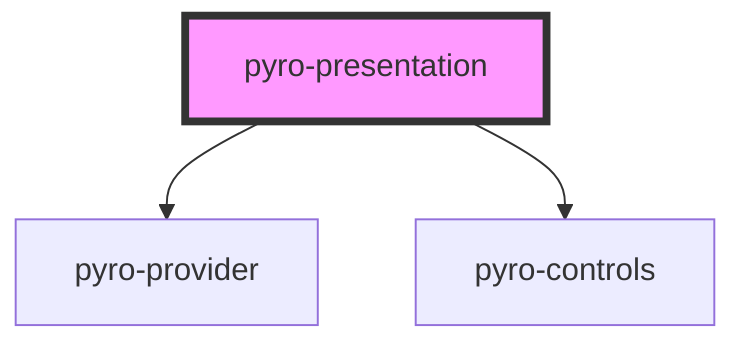

# pyro-presentation

<!-- Auto Generated Below -->

## Properties

| Property    | Attribute   | Description | Type               | Default     |
| ----------- | ----------- | ----------- | ------------------ | ----------- |
| `numbering` | `numbering` |             | `boolean`          | `undefined` |
| `options`   | `options`   |             | `object \| string` | `undefined` |

## Dependencies

### Depends on

- [pyro-provider](../provider)
- [pyro-controls](../controls)

### Graph

----------------------------------------------

*Built with [StencilJS](https://stenciljs.com/)*
