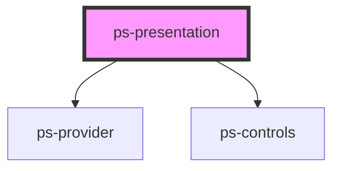

# ps-presentation

<!-- Auto Generated Below -->

## Properties

| Property  | Attribute | Description | Type               | Default     |
| --------- | --------- | ----------- | ------------------ | ----------- |
| `options` | `options` |             | `object \| string` | `undefined` |

## Dependencies

### Depends on

- [ps-provider](../provider)
- [ps-controls](../controls)

### Graph

----------------------------------------------

*Built with [StencilJS](https://stenciljs.com/)*
