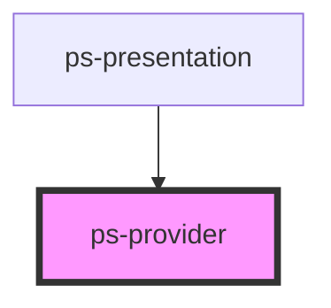

# ps-provider

<!-- Auto Generated Below -->

## Properties

| Property | Attribute | Description | Type                      | Default |
| -------- | --------- | ----------- | ------------------------- | ------- |
| `state`  | --        |             | `{ [key: string]: any; }` | `{}`    |

## Dependencies

### Used by

 - [ps-presentation](../presentation)

### Graph

----------------------------------------------

*Built with [StencilJS](https://stenciljs.com/)*
