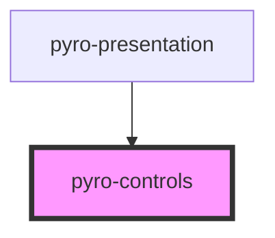

# pyro-controls

<!-- Auto Generated Below -->

## Properties

| Property              | Attribute | Description | Type          | Default     |
| --------------------- | --------- | ----------- | ------------- | ----------- |
| `presentationElement` | --        |             | `HTMLElement` | `undefined` |

## Dependencies

### Used by

- [pyro-presentation](../presentation)

### Graph

---

_Built with [StencilJS](https://stenciljs.com/)_
