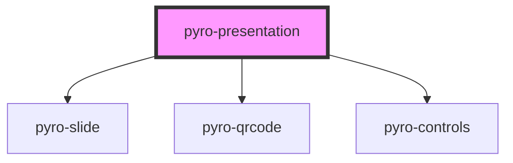

# pyro-presentation

<!-- Auto Generated Below -->

## Properties

| Property            | Attribute            | Description | Type      | Default     |
| ------------------- | -------------------- | ----------- | --------- | ----------- |
| `author`            | `author`             |             | `string`  | `undefined` |
| `numbering`         | `numbering`          |             | `boolean` | `undefined` |
| `presentationTitle` | `presentation-title` |             | `string`  | `undefined` |
| `subtitle`          | `subtitle`           |             | `string`  | `undefined` |
| `url`               | `url`                |             | `string`  | `undefined` |

## Dependencies

### Depends on

- [pyro-slide](../slide)
- [pyro-qrcode](../qrcode)
- [pyro-controls](../controls)

### Graph

---

_Built with [StencilJS](https://stenciljs.com/)_
