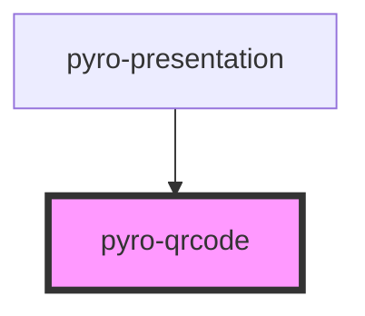

# pyro-qrcode

<!-- Auto Generated Below -->

## Properties

| Property  | Attribute | Description | Type     | Default     |
| --------- | --------- | ----------- | -------- | ----------- |
| `content` | `content` |             | `string` | `undefined` |

## Dependencies

### Used by

- [pyro-presentation](../presentation)

### Graph

---

_Built with [StencilJS](https://stenciljs.com/)_
