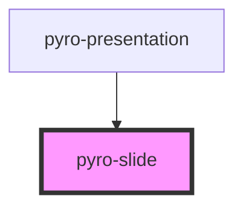

# pyro-slide

<!-- Auto Generated Below -->

## Properties

| Property           | Attribute           | Description | Type     | Default     |
| ------------------ | ------------------- | ----------- | -------- | ----------- |
| `backgroundColor`  | `background-color`  |             | `string` | `undefined` |
| `backgroundIframe` | `background-iframe` |             | `string` | `undefined` |
| `backgroundImage`  | `background-image`  |             | `string` | `undefined` |
| `slideTitle`       | `slide-title`       |             | `string` | `undefined` |

## Events

| Event         | Description | Type               |
| ------------- | ----------- | ------------------ |
| `injectProps` |             | `CustomEvent<any>` |

## Dependencies

### Used by

- [pyro-presentation](../presentation)

### Graph

---

_Built with [StencilJS](https://stenciljs.com/)_
